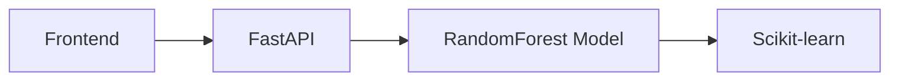

# Wine Quality Classification Project

## 📖 Описание проекта
Классификация качества вина (6 классов) на основе 11 физико-химических параметров. 

## 🛠 Технический стек
- **ML**: Scikit-learn, SMOTE
- **API**: FastAPI, Uvicorn
- **Frontend**: React.js


### Архитектура решения


Производительность модели
Метрика	Значение
Accuracy	0.8837
F1-score	0.8822
Precision	0.884
Recall	0.883

Пример запроса к API
```bash
curl -X POST "https://wine-model-api.herokuapp.com/predict" \
  -H "Content-Type: application/json" \
  -d '{"fixed_acidity":7.4, "volatile_acidity":0.7, ...}'
```
# Выводы
## Лучшая модель: RandomForest (F1=0.882 на тесте).

## Веб-интерфейс позволяет вводить параметры вина и получать предсказание.
